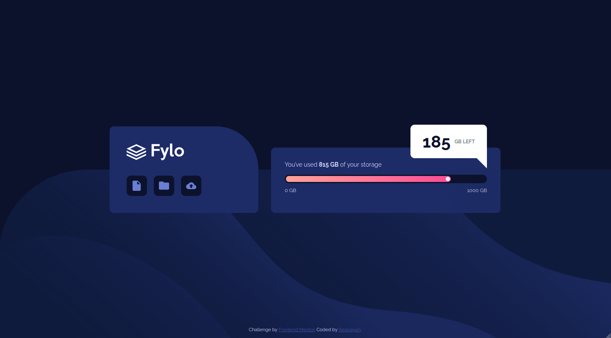

# Frontend Mentor - Fylo data storage component solution

This is a solution to the [Fylo data storage component challenge on Frontend Mentor](https://www.frontendmentor.io/challenges/fylo-data-storage-component-1dZPRbV5n). Frontend Mentor challenges help you improve your coding skills by building realistic projects.

## Table of contents

- [Frontend Mentor - Fylo data storage component solution](#frontend-mentor---fylo-data-storage-component-solution)
  - [Table of contents](#table-of-contents)
  - [Overview](#overview)
    - [The challenge](#the-challenge)
    - [Screenshot](#screenshot)
    - [Links](#links)
  - [My process](#my-process)
    - [Built with](#built-with)
  - [Author](#author)

## Overview

### The challenge

Users should be able to:

- View the optimal layout for the site depending on their device's screen size

### Screenshot

### Links

- Solution [On Frontend Mentor](https://www.frontendmentor.io/solutions/responsive-solution-using-flexbox-M83_lDR_6D)
- Live Site [On GitHub Pages](https://seapagan-fem.github.io/fylo-data-storage/)

## My process

### Built with

- Semantic HTML5 markup
- CSS custom properties
- Flexbox
- Mobile-first workflow

## Author

- Website - [Grant Ramsay](https://www.gnramsay.com)
- Frontend Mentor - [@seapagan](https://www.frontendmentor.io/profile/seapagan)
- Twitter - [@gnramsay_dev](https://www.twitter.com/gnramsay_dev)
